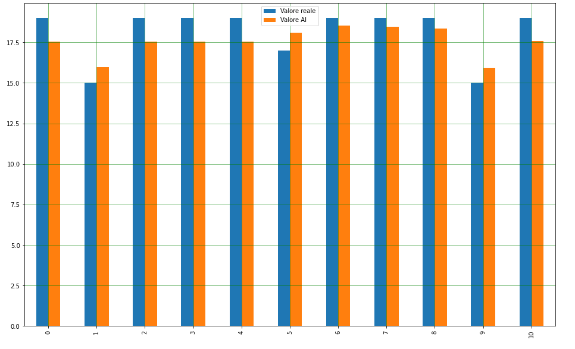

<h1 align="center">SoPEM Fitter</h1>

# Tabella dei contenuti

- [Introduzione](#introduzione)
- [Esecuzione](#esecuzione)
  - [Inserimento dataset](#inserimento-dataset)
  - [Impostazione config.json](#impostazione-config.json)
- [Licenza](#licenza)
  - [Autori / Copyright](#autori--copyright)
  - [Licenze componenti di terze parti](#licenze-componenti-di-terze-parti)
  - [Dettagli licenza](#dettagli-licenza)

# Introduzione
Questa repo contiene il codice sorgente del SoPEM Fitter - L'addestratore dell'AI per la calibrazione del sensore PM10.

# Esecuzione

Il codice è scritto in Python, e deve essere eseguito su Google Colab. 
Per avviare l'addestramento dell'AI scaricare il file .ipynb ed importarlo in Colab.

## Inserimento dataset
Fitter si basa sui dataset dell'ARPA Piemonte sul particolato per calibrare il sensore, disponibili su [http://www.arpa.piemonte.it/approfondimenti/temi-ambientali/aria/aria/semaforo-qualita-dellaria-pm10](http://www.arpa.piemonte.it/approfondimenti/temi-ambientali/aria/aria/semaforo-qualita-dellaria-pm10). Per inserire i propri dataset, assicurarsi che i riferimenti dell'ARPA siano compatibili con il csv linkato sopra, e assicurarsi inoltre che i dati campionati dal sensore da calibrare siano in un file CSV formattato nel seguente modo:

    PROVINCIA,CITTA,RIFERIMENTO,DATA,ORARIO,AVG_SENSORE
Una volta ottenuti i dati, hostarli su un sito (anche Github va bene) e modificare le seguenti variabili per adeguarle ai dataset caricati:

    ds_real_pm10 = pd.read_csv('https://raw.githubusercontent.com/is-sobrero/pm10-ml/master/datasets/arpa_pm10-20200618%20-%20arpa_pm10-20200618.csv')
    sense_pm10 = pd.read_csv('https://raw.githubusercontent.com/is-sobrero/pm10-ml/master/datasets/pontestura_pm10.csv')
    
Dove `ds_real_pm10` è il dataset dell'ARPA, mentre `sense_pm10` indica i dati del sensore.
## Impostazione config.json
Una volta eseguito lo script, esso restituirà in console un risultato simile al seguente:

    Accuratezza modello: 72.73% 
    Pendenza retta (m): -0.28 
    Pendenza retta (q): 19.45 
    Esempio di oggetto per il file config.json: 
    { 
      "sensor": { 
          "linear_m": -0.28, 
          "linear_q": 19.45, 
          "reference_voltage": 1.75 
      } 
    }
Oltre a restituire informazioni sul modello appena addestrato, fornisce un esempio di file config.json adattato al modello. Usare i valori indicati nell'output dello script per impostare correttamente il file config.json
# Licenza
## Autori / Copyright
Copyright 2020 (c) I.S. "A. Sobrero" / SoRobot Team
## Licenze componenti di terze parti
| Strumento   | Licenza      |
|-------------|--------------|
| [numpy](https://github.com/numpy/numpy)     | BSD 3-Clause |
| [pandas](https://github.com/pandas-dev/pandas) |BSD 3-Clause  |
| [scikit-learn](https://github.com/scikit-learn/scikit-learn) |New BSD  |
| [matplotlib](https://github.com/matplotlib/matplotlib) | PSF Based license
## Dettagli licenza
Il codice sorgente è rilasciato in licenza secondo GNU General Public License v3.0, che garantisce le quattro regole fondamentali del software libero anche sui fork dell'applicazione.
Per maggiori dettagli riguardo la licenza, consultare il file [LICENSE](LICENSE).
