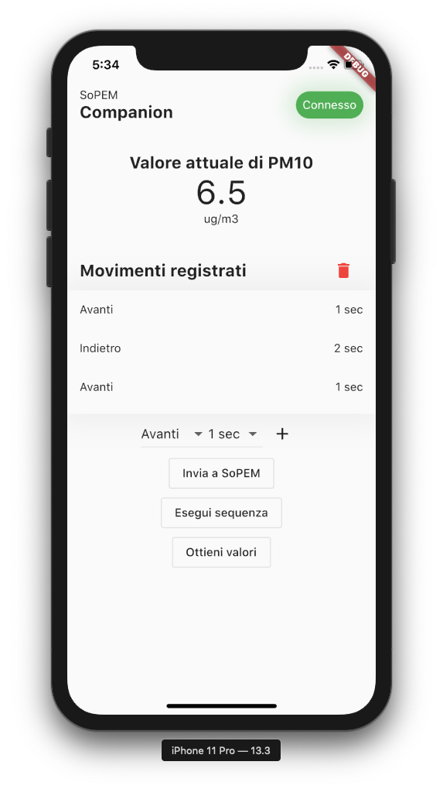

<h1 align="center">SoPEM Companion</h1>

# Tabella dei contenuti

- [Introduzione](#introduzione)
- [Installazione](#installazione)
  - [Framework Flutter](#framework-flutter)
  - [Clonazione del repository](#clonazione-del-repository)
  - [Compilazione app](#compilazione-app)
- [Licenza](#licenza)
  - [Autori / Copyright](#autori--copyright)
  - [Licenze componenti di terze parti](#licenze-componenti-di-terze-parti)
  - [Dettagli licenza](#dettagli-licenza)

# Introduzione
Questa repo contiene il codice sorgente del SoPEM Companion - L'app per programmare i movimenti di SoPEM.

La compatibilità cross-platform è garantita da Flutter, framework open-source sviluppato da Google per permettere l'esecuzione della stessa app, dalla stessa base di codice, su molteplici piattaforme.

# Installazione
L'installazione di SoPEM Companion prevede diversi step, sia per preparare l'ambiente di sviluppo che per preparare il dispositivo di destinazione.

## Framework Flutter
SoPEM Companion è basato completamente sul framework Flutter, per procedere con la compilazione dell'applicazione bisogna preparare l'ambiente di sviluppo Flutter nel computer.

L'ambiente Flutter è compatibile con la maggior parte dei sistemi operativi desktop: Windows, macOS, Linux e Chrome OS.

Predisporre l'ambiente di sviluppo secondo le guide linea descritte dalla guida ufficiale: https://flutter.dev/docs/get-started/install

Verificare che l'ambiente di sviluppo sia configurato correttamente lanciando il comando

    flutter doctor

da terminale, se il programma segnala errori, utilizzare le guide ufficiali di Google per risolverli.

## Clonazione del repository
Assicurarsi che git sia installato sul computer.

Clonare la repo tramite i comandi di Github.

## Compilazione app
Indipendentemente dal sistema operativo di destinazione, è consigliabile utilizzare Android Studio come ambiente di sviluppo, essendo attualmente l'IDE supportato maggiormente per lo sviluppo Flutter.
Bisognerà inoltre installare il plugin Flutter e Dart per Android Studio.

In base al sistema operativo di destinazione, bisognerà installare diversi strumenti:

- Android
  - Android SDK (incluso in Android Studio)
  - Dispositivo Android con le impostazioni da sviluppatore abilitate
  - Java JDK
- iOS
  - Xcode 11 (da App Store, disponibile solo su macOS)
  - CocoaPods

Se si sta compilando SoPEM Companion su macOS, dopo aver installato Xcode 11 eseguire i seguenti comandi da terminale:

    sudo xcode-select --switch /Applications/Xcode.app/Contents/Developer
    sudo xcodebuild -runFirstLaunch
    sudo xcodebuild -license

Testare la configurazione di macOS lanciando il seguente comando (avvio del simulatore)

    open -a Simulator

Una volta configurato l'ambiente di sviluppo, aprire il progetto con Android Studio, aprire il file pubspeck.yaml e cliccare "Packages get", qui Android Studio sincronizzerà il progetto con le dipendenze richieste.

Ora è possibile compilare l'applicazione: selezionare nel menù in alto a destra il dispositivo di destinazione, dopo averlo collegato al computer, e cliccare dal menù "Run" l'opzione "Flutter run main.dart in Release mode".
Il processo di compilazione è lungo, soprattutto la prima volta, attendere col dispositivo di destinazione collegato al computer per tutta la durata dell'operazione.

# Licenza
## Autori / Copyright
Copyright 2020 (c) I.S. "A. Sobrero" / SoRobot Team
## Licenze componenti di terze parti
| Strumento   | Licenza      |
|-------------|--------------|
| [Flutter](https://github.com/flutter/flutter)     | BSD 3-Clause |
| [mqtt_client](https://github.com/shamblett/mqtt_client) | MIT License  |
## Dettagli licenza
Il codice sorgente è rilasciato in licenza secondo GNU General Public License v3.0, che garantisce le quattro regole fondamentali del software libero anche sui fork dell'applicazione.
Per maggiori dettagli riguardo la licenza, consultare il file [LICENSE](LICENSE).